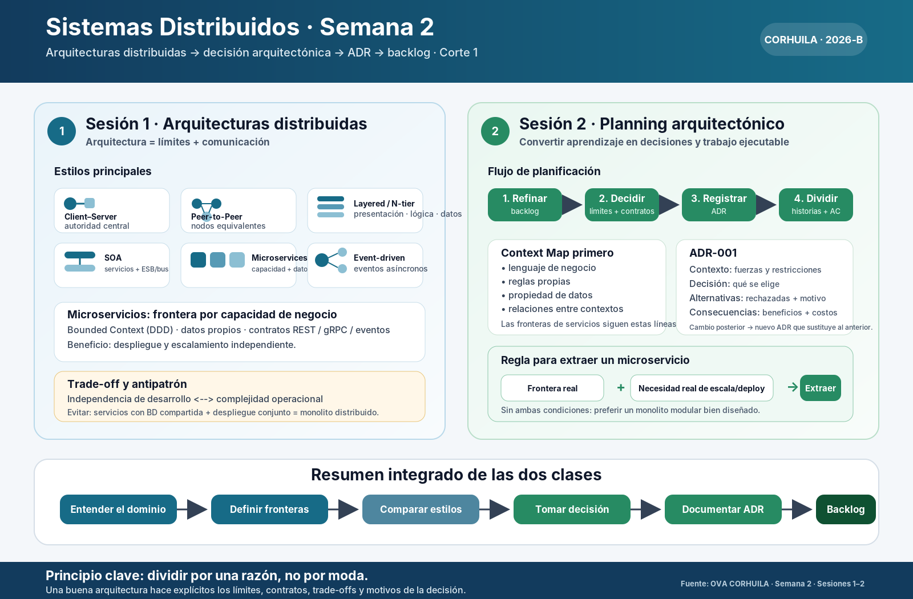

<!-- PLANTILLA HU-STATUS (traduccion al espanol) - NO borres los marcadores <!-- ... -->
     ni las cabeceras de tabla.
     ATENCION: la nota semanal se lee AUTOMATICAMENTE del archivo en ingles:
       01-week/hu-status/README.md  (dentro de TU fork).
     Este archivo es una copia en espanol para lectura y no se califica. -->

# Estado Semanal - Semana 01

<!-- CONFIG-START - debe coincidir con el CONFIG de tu repo de perfil (username/username) -->
- FULL_NAME: Jesus Ariel Gonzalez Bonilla
- GITHUB_USER: ariel5253
- TEAM: Grupo 1 - PRJ-FERRETERIA-V13
- SPRINT_GOAL: Convertir el brief de control de dinero de la ferreteria en un mapa de contextos acotados, un ADR para el estilo arquitectonico y un backlog verificable de historias de ingresos, egresos y resumenes.
<!-- CONFIG-END -->

## 1. Historias de usuario trabajadas esta semana
| HU ID | Titulo | Estado (todo/doing/done) | Evidencia (URL de PR o commit) |
|---|---|---|---|
| HU-FIN-001 | Registrar un ingreso con fecha, categoria, valor y nota opcional | doing | https://github.com/code-corhuila/sistemas-distribuidos-2026-b-g1/commit/b4ae1cc |
| HU-FIN-002 | Registrar un egreso con fecha, categoria, valor y nota opcional | todo | Pendiente - rama hu-fin-002-dev aun no creada |
| HU-FIN-003 | Consultar un resumen por periodo (dia/semana/mes) con total de ingresos, total de egresos y saldo neto | doing | https://github.com/code-corhuila/sistemas-distribuidos-2026-b-g1/commit/b4ae1cc |
| HU-FIN-004 | Administrar las categorias de ingreso y egreso para clasificar cada movimiento | todo | Pendiente - rama hu-fin-004-dev aun no creada |
| HU-FIN-005 | Listar el detalle de movimientos de un periodo para conciliar un saldo que no cuadra | todo | Pendiente - rama hu-fin-005-dev aun no creada |

## 2. Mi contribucion individual
- Escribi el product brief (`prd.md`) de PRJ-FERRETERIA-V13: contexto inicial, necesidades y problemas, proceso actual, preguntas abiertas y glosario de negocio (ingreso, egreso, saldo neto, corte diario, periodo, categoria).
- Fije el stack declarado y sus limites: Angular en el frontend, Go en el backend y MySQL como base de datos. Deje el producto explicitamente **fuera** de POS, facturacion, inventario por producto y ERP: el entregable es unicamente control financiero agregado.
- Derive el primer backlog (HU-FIN-001 .. HU-FIN-005) a partir de la seccion de necesidades y problemas, de modo que cada historia se pueda rastrear hasta una necesidad de negocio declarada y no a una suposicion tecnica.
- Apliqué el material de la Sesion de Semana 2 (ver el resumen mas abajo): elabore primero el **context map** - un unico contexto acotado `Finanzas` que es dueno de movimientos, categorias y resumenes por periodo - antes de proponer cualquier frontera de servicio.
- Inicie el **ADR-001 (estilo arquitectonico)**: contexto = un solo administrador, volumen bajo de transacciones, consultas agregadas diarias/semanales/mensuales; decision = monolito modular en Go con contrato REST para Angular; alternativas rechazadas = microservicios (no existe necesidad real de escala ni de despliegue independiente) y event-driven (no hay integracion asincrona en el alcance); consecuencias = operacion mas simple ahora y un unico punto de extraccion mas adelante si el reporteo crece.
- Apliqué la regla de extraccion de microservicios vista en clase (frontera real **+** necesidad real de escala/despliegue). Hoy no se cumple ninguna de las dos, asi que la decision queda documentada como "monolito modular bien disenado" y no como un monolito distribuido con base de datos compartida.
- Bosqueje el capeado hexagonal del lado Go: `domain` (Movimiento, Categoria, Periodo y el calculo de saldo neto) sin I/O, `application` (casos de uso) e `infrastructure` (repositorio MySQL y handlers HTTP).

## 3. Bloqueos y riesgos
- **Las preguntas abiertas del brief siguen sin respuesta** y bloquean los criterios de aceptacion: catalogo inicial de categorias, usuario unico o varios usuarios, si el corte diario bloquea ediciones posteriores, si los movimientos se pueden editar o anular, exportacion a CSV/PDF y si el saldo neto es solo por periodo o tambien acumulado.
- Las respuestas sobre editar/anular y sobre el corte diario cambian el modelo de dominio de forma directa (libro inmutable con asientos de reversion frente a filas mutables), por lo que HU-FIN-001 y HU-FIN-002 no se pueden cerrar hasta decidirlo.
- El nivel de seguridad de acceso al sistema no esta definido; sin eso no puedo dimensionar la historia de autenticacion ni decidir si pertenece al Corte 1.
- Todavia no existen las ramas de entorno (`develop`, `qa`) en el repositorio, por lo que esta semana no se pudo ejercitar el flujo de rama HU + PR por entorno: solo existe `main`.
- Riesgo de desviacion de alcance hacia un POS: el brief lo descarta, y cada historia nueva debe contrastarse contra ese limite antes de entrar al backlog.

## 4. Plan para la proxima semana
- Cerrar las preguntas abiertas con el interesado y convertir cada respuesta en un criterio de aceptacion.
- Publicar el `ADR-001` como archivo del repositorio (Contexto / Decision / Alternativas / Consecuencias) siguiendo la plantilla de la sesion.
- Crear `develop` y `qa`, y luego abrir `hu-fin-001-dev` y `hu-fin-002-dev` con sus PR hacia `develop`.
- Implementar el dominio `Movimiento` y `Categoria` en Go con pruebas unitarias del calculo de saldo neto, manteniendo el dominio libre de I/O.
- Definir el esquema MySQL (movimientos, categorias) y el contrato REST que consumira Angular.
- Construir el endpoint de resumen por periodo (dia/semana/mes) con una prueba de integracion contra MySQL.

## 5. Autoevaluacion de cumplimiento
- [x] Conventional Commits - `type(scope): summary`
- [ ] Rama HU + PR por entorno (hu-xxx-dev -> develop, ...)
- [ ] Criterios de aceptacion verificables
- [ ] Pruebas agregadas o actualizadas (unitarias / integracion)
- [ ] Limites DDD / hexagonal respetados (el dominio no tiene I/O)
- [x] Sin secretos; configuracion por variables de entorno

Notas sobre los items sin marcar:
- Hasta ahora solo existe `main`, por lo que no se pudo abrir ninguna rama HU ni PR hacia `develop`.
- Los criterios de aceptacion siguen en borrador hasta responder las preguntas abiertas de la seccion 3.
- Esta semana no se escribio codigo de produccion, asi que todavia no hay nada que probar.
- El capeado hexagonal esta disenado pero aun no materializado en codigo.

## 6. Enlaces de evidencia
- Product brief: [`prd.md`](./prd.md) - PRJ-FERRETERIA-V13 (contexto, necesidades, proceso actual, preguntas abiertas y glosario).
- Commit de estructura del repositorio: https://github.com/code-corhuila/sistemas-distribuidos-2026-b-g1/commit/b4ae1cc
- Material de aprendizaje del curso (OVAs): https://code-corhuila.github.io/ova-web/2026-B/distribuidos/
- Resumen de la sesion usado para la decision arquitectonica - fuente vectorial: [`resumen_sistemas_distribuidos_semana_2.svg`](./resumen_sistemas_distribuidos_semana_2.svg)

Principio clave tomado del material: **dividir por una razon, no por moda**. Una buena arquitectura hace explicitos los limites, los contratos, los trade-offs y el motivo de la decision.
